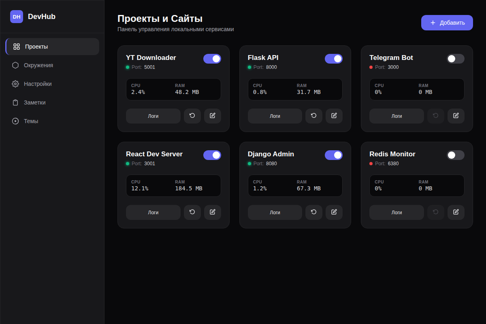
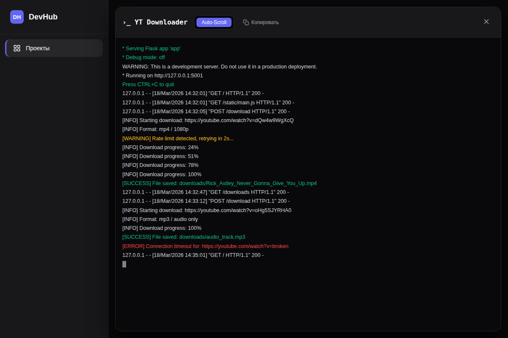
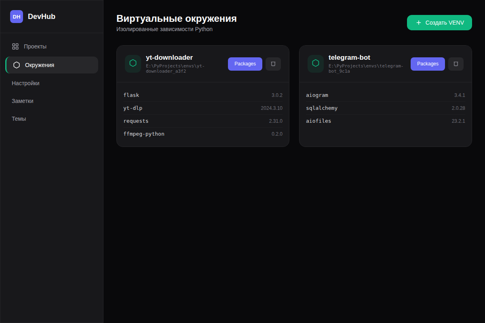
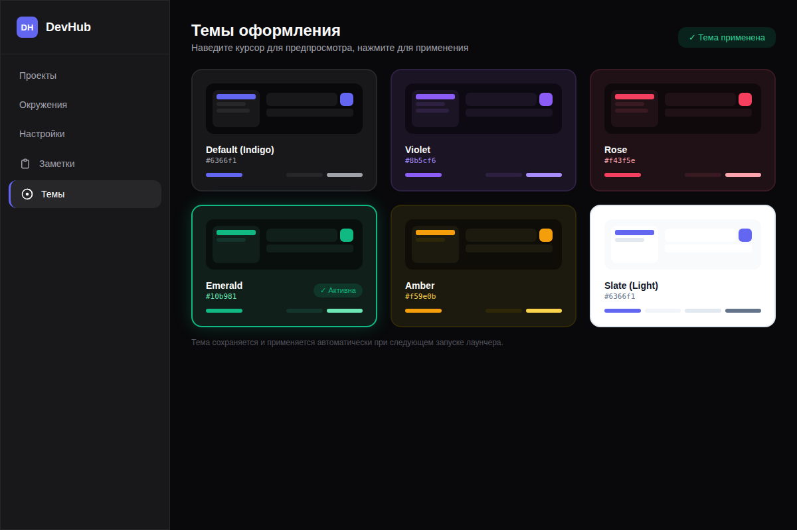

<div align="center">


# DevHub Launcher

**Единый центр управления всеми твоими локальными проектами**

[](https://python.org)
[](https://vuejs.org)
[](LICENSE)
[](https://github.com/YOUR_USERNAME/devhub-launcher/releases)
[](https://github.com/YOUR_USERNAME/devhub-launcher/releases)
[](docs/plugins.md)

<br/>

> Устал запускать 5 консолей, помнить порты и следить за кучей окон?  
> **DevHub Launcher** решает это одной кнопкой.

<br/>



<br/>

[**⬇ Скачать**](https://github.com/YOUR_USERNAME/devhub-launcher/releases/latest) · [**📖 Документация**](docs/) · [**🧩 Плагины**](docs/PLUGIN_GUIDE.md) · [**💬 Обсуждения**](https://github.com/YOUR_USERNAME/devhub-launcher/discussions)

</div>

---

## 🤔 Зачем это нужно?

Представь: у тебя есть несколько локальных проектов — Flask API, Telegram-бот, React dev server, какой-нибудь парсер. Каждый раз, садясь за работу, ты открываешь **4 разных окна терминала**, вводишь одни и те же команды, вспоминаешь на каком порту что запущено, и следишь за несколькими консолями одновременно.

DevHub Launcher заменяет весь этот ритуал **одним окном**:

```
Было:                          Стало:
────────────────────           ───────────────────
cd E:\projects\yt              Открыл DevHub
.venv\Scripts\activate         Нажал переключатель ─── YT Downloader ●
python app.py --port 5001

cd E:\projects\bot
.venv\Scripts\activate
python bot.py                  Нажал переключатель ─── Telegram Bot ●

cd E:\projects\api
.venv\Scripts\activate
python -m flask run --port 8000 ↑ Flask API ●

Открыл 3 окна CMD,
смотришь в 3 терминала...      Смотришь в один интерфейс.
```

---

## ✨ Возможности

<table>
<tr>
<td width="50%">

### 🚀 Управление процессами
Запускай, останавливай и перезапускай любое приложение одним переключателем. Никаких лишних консольных окон — всё работает в фоне.

</td>
<td width="50%">

### 📊 Мониторинг ресурсов
CPU и RAM каждого проекта в реальном времени. Сразу видно, кто из твоих сервисов «жрёт» больше всего.

</td>
</tr>
<tr>
<td>

### 🔒 Изолированные VENV
Создавай и управляй виртуальными окружениями Python прямо из интерфейса. У каждого проекта — своя изолированная среда.

</td>
<td>

### 📦 Менеджер пакетов
Устанавливай и удаляй pip-пакеты для каждого окружения. Лог установки — прямо в интерфейсе.

</td>
</tr>
<tr>
<td>

### 📋 Встроенный терминал логов
Логи каждого приложения — внутри лаунчера. Автопрокрутка, копирование, цветная подсветка уровней.

</td>
<td>

### ⚡ Автозапуск
Настрой какие проекты стартуют вместе с лаунчером. Включи автозагрузку Windows — и всё поднимется само при включении ПК.

</td>
</tr>
<tr>
<td>

### 🧩 Система плагинов
Расширяй функциональность через плагины. Плагины добавляют вкладки, бэкенд-методы и UI — без изменения исходного кода.

</td>
<td>

### 🎨 Темы оформления
6 встроенных тем через плагин Themes. Предпросмотр при наведении, мгновенное применение по всему интерфейсу.

</td>
</tr>
</table>

---

## 🖼 Скриншоты

<details open>
<summary><b>Проекты — главный экран</b></summary>
<br/>


Все твои проекты на одном экране. Зелёный огонёк — работает. Красный — выключен. CPU и RAM обновляются каждые 2 секунды.

</details>

<details>
<summary><b>Терминал логов</b></summary>
<br/>



Встроенный лог-вьювер с подсветкой уровней: зелёный — INFO/SUCCESS, жёлтый — WARNING, красный — ERROR.

</details>

<details>
<summary><b>Виртуальные окружения</b></summary>
<br/>



Создавай VENV, просматривай список пакетов и управляй зависимостями прямо из интерфейса.

</details>

<details>
<summary><b>Плагин: Темы оформления</b></summary>
<br/>



6 встроенных тем. Наведи курсор — увидишь предпросмотр. Кликни — тема применится ко всему интерфейсу мгновенно.

</details>

---

## ⚡ Быстрый старт

### Требования

- **Windows 10/11** (WebView2 / Edge)
- **Python 3.10+**

### Установка

```bash
# 1. Клонируй репозиторий
git clone https://github.com/YOUR_USERNAME/devhub-launcher.git
cd devhub-launcher

# 2. Создай виртуальное окружение
python -m venv .venv
.venv\Scripts\activate

# 3. Установи зависимости
pip install -r requirements.txt

# 4. Запусти!
python main.py
```

### Добавление первого проекта

1. Открой вкладку **Проекты** → нажми **+ Добавить**
2. Заполни поля:

| Поле | Пример | Описание |
|------|--------|----------|
| **Название** | `YT Downloader` | Любое удобное имя |
| **Рабочая папка** | `E:\Projects\yt` | Папка проекта (кнопка 📁 для выбора) |
| **Команда** | `python app.py --port {port}` | `{port}` заменится автоматически |
| **Порт** | `5001` | Свободный порт для сервиса |
| **VENV** | `yt-env` | Окружение (или «Глобальное») |

3. Нажми **Сохранить** — проект появится на панели
4. Переключи тогл — проект запустится 🚀

> **Подсказка:** Чтобы проект поддерживал `--port`, добавь в его `main.py`:
> ```python
> import argparse
> parser = argparse.ArgumentParser()
> parser.add_argument('--port', type=int, default=5000)
> args = parser.parse_args()
> app.run(port=args.port)
> ```

---

## 🧩 Система плагинов

DevHub Launcher поддерживает плагины — они добавляют новые вкладки, Python-методы и стили без изменения исходного кода лаунчера.

### Встроенные плагины

| Плагин | Описание |
|--------|----------|
| 📝 **Notes** | Менеджер заметок с цветовыми метками и поиском |
| 🎨 **Themes** | 6 тем оформления с предпросмотром при наведении |

### Установка стороннего плагина

**Из GitHub:**
Настройки → Плагины → вставь ссылку на репозиторий → Установить

**Вручную:**
Скопируй папку плагина в `plugins/` и перезапусти лаунчер.

### Написать свой плагин — просто

Минимальный плагин — это папка с двумя файлами:

```
plugins/
└── my_plugin/
    ├── __init__.py   ← Python-бэкенд
    └── ui.js         ← Vue-компонент
```

**`__init__.py`** — регистрируем методы:
```python
import os

def setup(ctx):
    ctx.register_ui(os.path.join(os.path.dirname(__file__), "ui.js"))

    def get_data():
        return ctx.get_data("items") or []

    def save_item(item: dict):
        items = get_data()
        items.append(item)
        ctx.set_data("items", items)
        return True

    ctx.register_method("get_data",  get_data)
    ctx.register_method("save_item", save_item)
```

**`ui.js`** — регистрируем вкладку:
```javascript
(function () {
    const { ref, onMounted } = window.Vue;

    DevHubAPI.registerTab('my_plugin', 'Мой плагин', `<svg>...</svg>`, {
        setup() {
            const items = ref([]);

            onMounted(async () => {
                items.value = await DevHubAPI.call('my_plugin', 'get_data');
            });

            return { items };
        },
        template: `
            <div class="p-8">
                <h2 class="text-2xl font-bold text-white">Мой плагин</h2>
                <div v-for="item in items" class="glass-panel p-4 rounded-xl mt-4">
                    {{ item }}
                </div>
            </div>
        `
    });
})();
```

📖 **[Полная документация по плагинам →](docs/PLUGIN_GUIDE.md)**

---

## 🏗 Архитектура

```
devhub-launcher/
│
├── main.py                  # Точка входа
├── constants.py             # Пути и константы
│
├── api/
│   └── launcher_api.py      # Мост JS ↔ Python (pywebview API)
│
├── core/
│   ├── data_store.py        # JSON-хранилище настроек
│   ├── process_manager.py   # Управление процессами + psutil
│   ├── env_manager.py       # VENV + pip
│   └── plugin_manager.py    # Загрузка плагинов + PluginContext
│
├── utils/
│   └── system_utils.py      # Реестр Windows, диалоги
│
├── ui/                      # Фронтенд
│   ├── index.html
│   └── js/
│       ├── main.js          # Инициализация Vue
│       ├── store.js         # Реактивное состояние
│       ├── plugin_api.js    # window.DevHubAPI
│       └── components/      # Vue-компоненты вкладок
│
├── plugins/                 # Плагины пользователя
│   ├── notes/
│   └── themes/
│
├── plugins_data/            # Изолированные данные плагинов
├── environments/            # Виртуальные окружения Python
└── python_base/             # Портативный Python (опционально)
```

### Стек технологий

| Слой | Технология |
|------|-----------|
| **Backend** | Python 3.10+, pywebview |
| **Process monitoring** | psutil |
| **Frontend framework** | Vue.js 3 (Composition API) |
| **Styling** | Tailwind CSS |
| **Desktop wrapper** | pywebview (WebView2 / Edge) |

### Как работает система плагинов

```
main.py
  └── PluginManager.load_plugins(api)
        └── для каждой папки в plugins/:
              ├── создаёт PluginContext (изолированная песочница)
              └── вызывает plugin.__init__.setup(ctx)
                    ├── ctx.register_ui("ui.js")      → файл в очередь
                    └── ctx.register_method("name", fn) → в PluginMethodRegistry

pywebview.create_window(js_api=api)   ← API "заморожен" здесь
  └── api.call_plugin(id, method, args) ← единственный диспетчер для всех плагинов

Фронтенд:
  main.js → get_ui_plugins_code() → исполняет ui.js каждого плагина
  DevHubAPI.call("notes", "save", data) → pywebview.api.call_plugin(...)
                                           └── PluginMethodRegistry.call(...)
                                                 └── вызывает нужную функцию
```

---

## 📋 Roadmap

### v0.3.0 — следующий релиз
- [ ] 📦 **Упаковка в .exe** через PyInstaller — запуск без Python
- [ ] 🔔 **Системные уведомления** — «Проект X упал», «Готово»
- [ ] 🌐 **Поддержка Node.js проектов** — `npm start`, `yarn dev`
- [ ] 📑 **Несколько вкладок логов** — переключение между проектами без закрытия окна

### v0.4.0
- [ ] 🔄 **Импорт/Экспорт конфигурации** — перенос настроек между машинами
- [ ] 🗂 **Группы проектов** — «Frontend», «Backend», «Боты»
- [ ] 🔍 **Поиск и фильтрация** в списке проектов
- [ ] 📊 **График использования ресурсов** — история CPU/RAM по времени

### v1.0.0
- [ ] 🐧 **Linux / macOS поддержка**
- [ ] 🔌 **Маркетплейс плагинов** — браузер и установка в один клик
- [ ] 🐳 **Docker интеграция** — управление контейнерами
- [ ] ☁️ **Синхронизация настроек** через облако

---

## 🤝 Вклад в проект

Pull request'ы приветствуются! Для крупных изменений — сначала открой issue для обсуждения.

```bash
# Форкни репозиторий, потом:
git clone https://github.com/YOUR_USERNAME/devhub-launcher.git
cd devhub-launcher
git checkout -b feature/my-awesome-feature

# После изменений:
git commit -m "feat: добавил крутую фичу"
git push origin feature/my-awesome-feature
# Открой Pull Request
```

### Хочешь написать плагин?

Отличный способ внести вклад! Прочитай [документацию по плагинам](docs/PLUGIN_GUIDE.md) и открой PR с папкой в `plugins/`. Лучшие плагины попадут в основной репозиторий.

---

## 💬 FAQ

<details>
<summary><b>Нужен ли Python для запуска?</b></summary>

Пока да — для запуска из исходников нужен Python 3.10+. В планах на v0.3.0 — упаковка в `.exe` через PyInstaller.

</details>

<details>
<summary><b>Работает ли на Linux / macOS?</b></summary>

Пока официально только Windows. Основные зависимости кроссплатформенны, но `system_utils.py` использует реестр Windows для автозапуска. Поддержка Linux/macOS — в планах на v1.0.

</details>

<details>
<summary><b>Мой проект не на Python, можно им управлять?</b></summary>

Да! Лаунчер запускает любую команду через `shell=True`. Просто укажи нужную команду:
- Node.js: `node server.js --port {port}` или `npx vite --port {port}`
- Go: `./myapp --port {port}`
- Ruby: `ruby app.rb -p {port}`

</details>

<details>
<summary><b>Что если лаунчер упадёт? Мои процессы умрут?</b></summary>

Нет. PID всех запущенных процессов сохраняются в `run_state.json`. При следующем запуске лаунчер восстановит контроль над живыми процессами.

</details>

<details>
<summary><b>Как работает {port} в команде?</b></summary>

`{port}` — специальный плейсхолдер. Лаунчер заменяет его значением из поля «Порт» перед запуском. Это позволяет динамически назначать порты и избегать конфликтов между проектами.

</details>

---

## 📄 Лицензия

Распространяется под лицензией [MIT](LICENSE).

---

<div align="center">

Сделано с ❤️ для разработчиков, у которых слишком много проектов

**[⭐ Поставь звезду](https://github.com/YOUR_USERNAME/devhub-launcher)** — это помогает проекту расти

</div>
